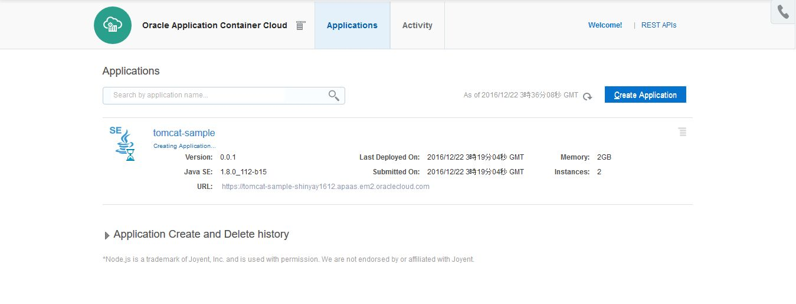

# Application Container Cloud Service へ 実行可能 WAR 形式にした Tomcat をデプロイ
---
## 説明


**Oracle Application Container Cloud Service** は、基盤を Docker とするアプリケーションの実行環境を提供するクラウド・サービスです。

そのため、エントリポイントを指定して起動できる状態の Java ランタイム上で稼働するアプリケーションであれば、簡単に実行環境の作成が可能です。

以前、Web アプリケーションをデプロイ済みの Tomcat を Application Container Cloud Service へデプロイしてみました。

- [Application Container Cloud Service へ Tomcat をデプロイしてみた](http://qiita.com/shinyay/items/52b253dfb9b926c0ce6a)

この時のエントリポイントとして設定していた起動コマンドは、`catalina.sh run` でした。つまり、通常通り Tomcat を起動しています。

ところで、Java のランタイム上で実行コマンドにより起動するものであれば、原則として実行環境の作成が行えるので別の方法 (実行可能WAR形式) での起動を試してみます。

### 実行可能 WAR 形式

CI ツールである **Jenkins** 環境を作成した事がある方は少なからずいると思います。
Jenkins の起動方法を覚えているでしょうか。次のように起動します:

```bash
$ java -jar jenkins.war
```

あたかも、実行可能形式 JAR のように WAR ファイルを実行していました。
WAR ファイルも JAR ファイルも 実体は、zip ファイルです。

以下のようにそれぞれのファイルヘッダからも zip ファイルであることが分かると思います。

```bash
$ od -c catalina.jar |more
0000000   P   K 003 004  \n  \0  \0  \b  \b  \0 254 273   g   I 326   O

$ od -c tomcat-sample.war |more
0000000   P   K 003 004  \n  \0  \0  \0  \0  \0   &   x 224   I  \0  \0
```

このように、同じファイルフォーマットでありながらも、実行可能か否かを分けているのはアーカイブ・ファイル自体の構成です。
実行可能 JAR については、Java のマニュアルの次の箇所に記載があります:
- [jar](http://docs.oracle.com/javase/8/docs/technotes/tools/windows/jar.html)

JAR ファイルでは、アーカイブファイルのメタ情報を扱っている **MANIFET.MF** に **Main-Class** で起動ポイントとなるクラスファイルを明記します。

WAR ファイルも同様にして、メタ情報の設定により実行可能 WAR 形式にしてみます。

Jeknins では、jekins.war に含まれている MANIFEST.MF を見てみると、次のように **Main-Class** が明記されています:

```
Manifest-Version: 1.0
Jenkins-Version: 2.19.4
Implementation-Version: 2.19.4
Hudson-Version: 1.395
Build-Jdk: 1.7.0_21
Built-By: kohsuke
Created-By: Apache Maven 3.3.9
Main-Class: Main
Archiver-Version: Plexus Archiver
...
...
Name: Main.class
SHA-256-Digest: 7R+cXQRTUtlWWMkHLv61/LnFq+epcUtxiSpynNvD+tc=
...
...
```

## 手順

### Tomcat の実行可能 WAR 形式 の作成方法

Tomcat の実行可能 WAR を作成します。
作成するには、次の２つの方法が考えられます。

1. **Embedded Tomcat** の利用
2. **Apache Tomcat Maven Plugin** の利用

#### 1. **Embeddedc Tomcat** の利用

Tomcat 7 から、**Embedded Tomcat** と呼ばれる組み込み版の Tomcat API が実装されました。***Jetty*** のようにアプリケーションに組み込みでサーバインスタンスを使用する事ができます。
- [org.apache.catalina.startup.Tomcat](https://tomcat.apache.org/tomcat-7.0-doc/api/org/apache/catalina/startup/Tomcat.html) クラス

この API を利用して Tomcat サーバインスタンスを開始させる Main クラスを用意します。この Main クラスや、Tomcat 関連のライブラリ、またアプリケーション自体のクラスファイルを含めた **Fat JAR / Uber JAR** と呼ばれる全ての依存ライブラリを展開して含んでいるアーカイブ・ファイルを作成する方法です。

#### 2. **Apache Tomcat Maven Plugin** の利用

以前に実施した IntelliJ 上で Maven を利用してアプリケーションを Tomcat にデプロイを行った以下の内容があります:

- [IntelliJ IDEA を使って Web アプリケーションを Tomcat へデプロイしてみた](http://qiita.com/shinyay/items/a3561bae8f0b1804bbb4)

この中で利用した Maven のプラグインが、Tomcat 7 用の **Apache Tomcat Maven Plugin**　である **org.apache.tomcat.maven.tomcat7-maven-plugin** でした。

このプラグインを使用すると、Tomcat のライフサイクル管理以外にも **Executable WAR/JAR** の作成ができます。このプラグイン機能を利用して WAR ファイルを作成する方法です。

### **Apache Tomcat Maven Plugin** の利用した実行可能 WAR の作成

今回は、**org.apache.tomcat.maven.tomcat7-maven-plugin** を利用して、実行可能 WAR ファイルを作成してみます。

#### Maven pom.xml の build 要素

**pom.xml** に以下のように **tomcat7-maven-plugin** の設定を追加します。

```xml:pom.xml
<build>
...
...
    <plugin>
      <groupId>org.apache.tomcat.maven</groupId>
      <artifactId>tomcat7-maven-plugin</artifactId>
      <version>2.1</version>
      <executions>
        <execution>
          <id>tomcat-run</id>
          <goals>
            <goal>exec-war-only</goal>
          </goals>
          <phase>package</phase>
          <configuration>
            <path>/</path>
            <finalName>${project.artifactId}-${project.version}.war</finalName>
          </configuration>
        </execution>
      </executions>
    </plugin>
...
...
</build>
```

注意する点は **version** 属性の値を **2.1** としているところです。
*tomcat7-maven-plugin* の *2.2* には、バグがあり **exec-war-only** ゴールが正常に動作しません。

- [\[MTOMCAT-263\] tomcat7:exec-war can't create .extract/webapps](https://issues.apache.org/jira/browse/MTOMCAT-263)
- [maven-tomcat7-plugin produces corrupted executable JAR](http://stackoverflow.com/questions/22237388/maven-tomcat7-plugin-produces-corrupted-executable-jar)

バージョン 2.3 のリリースの待ちのようです。そこで、使用するバージョンは **2.1** としています。

#### mvn package の実行

先の pom.xml の設定で、package フェーズで tomcat7-maven-plugin による実行可能 WAR がパッケージされるように構成しています。
そこで、`mvn package` を実行しています。

```bash
$ mvn package
[INFO] Scanning for projects...
[INFO]
[INFO] ------------------------------------------------------------------------
[INFO] Building Tomcat Sample Application 1.0-SNAPSHOT
[INFO] ------------------------------------------------------------------------
[INFO]
[INFO] --- maven-resources-plugin:2.6:resources (default-resources) @ employees-app ---
[WARNING] Using platform encoding (MS932 actually) to copy filtered resources, i.e. build is platform dependent!
[INFO] Copying 0 resource
[INFO]
[INFO] --- maven-compiler-plugin:3.6.0:compile (default-compile) @ employees-app ---
[INFO] Changes detected - recompiling the module!
...
...
...
[INFO] Processing war project
[INFO] Copying webapp resources [D:\msys64\home\shinyay\work\git-repo\oracle-accs-tomcat-exec-war\maven\employees-app\src\main\webapp]
[INFO] Webapp assembled in [130 msecs]
[INFO] Building war: D:\msys64\home\shinyay\work\git-repo\oracle-accs-tomcat-exec-war\maven\employees-app\target\tomcat-sample.war
[INFO] WEB-INF\web.xml already added, skipping
[INFO]
[INFO] --- tomcat7-maven-plugin:2.1:exec-war-only (tomcat-run) @ employees-app ---
[INFO] ------------------------------------------------------------------------
[INFO] BUILD SUCCESS
[INFO] ------------------------------------------------------------------------
[INFO] Total time: 8.452 s
[INFO] Finished at: 2016-12-21T13:33:31+09:00
[INFO] Final Memory: 40M/219M
[INFO] ------------------------------------------------------------------------
```

Maven の実行が終了すると、target ディレクトリ配下に実行可能 WAR ファイルが生成されています。

```bash
$ ls -l target/
合計 9670
drwxr-xr-x 1 shinyay なし       0 12月 21 13:44 classes
-rw-r--r-- 1 shinyay なし 9373879 12月 21 13:45 employees-app-1.0-SNAPSHOT.war
drwxr-xr-x 1 shinyay なし       0 12月 21 13:44 generated-sources
drwxr-xr-x 1 shinyay なし       0 12月 21 13:44 maven-archiver
drwxr-xr-x 1 shinyay なし       0 12月 21 13:44 maven-status
drwxr-xr-x 1 shinyay なし       0 12月 21 13:44 tomcat-sample
-rw-r--r-- 1 shinyay なし  524115 12月 21 13:44 tomcat-sample.war
-rw-r--r-- 1 shinyay なし      86 12月 21 13:45 war-exec.manifest
-rw-r--r-- 1 shinyay なし     240 12月 21 13:44 war-exec.properties
```

`employees-app-1.0-SNAPSHOT.war` という名前で実行可能 WAR ファイルが生成されました。

#### 実行可能 WAR のテスト実行

生成された実行可能 WAR をテスト実行してみます。

```bash
$ java -jar employees-app-1.0-SNAPSHOT.war
12 21, 2016 1:48:19 午後 org.apache.coyote.AbstractProtocol init
情報: Initializing ProtocolHandler ["http-bio-8080"]
12 21, 2016 1:48:19 午後 org.apache.catalina.core.StandardService startInternal
情報: Starting service Tomcat
12 21, 2016 1:48:19 午後 org.apache.catalina.core.StandardEngine startInternal
情報: Starting Servlet Engine: Apache Tomcat/7.0.37
12 21, 2016 1:48:21 午後 org.apache.catalina.util.SessionIdGenerator createSecureRandom
情報: Creation of SecureRandom instance for session ID generation using [SHA1PRNG] took [527] milliseconds.
12 21, 2016 1:48:21 午後 org.apache.coyote.AbstractProtocol start
情報: Starting ProtocolHandler ["http-bio-8080"]
```

[ローカルホストの デフォルト 8080 番ポート](http://localhost:8080)にアクセスしてみます。
以下のように正常にアクセスできました:


次に、起動オプション **-httpPort** をつけて、デフォルト・ポートの 8080 番以外のポートを指定しての起動をしてみます。ここでは、***9090*** 番ポートを指定して起動してみます:


このように実行可能 WAR ファイルとして正常に起動する事が確認できました。

### Application Container Cloud Service へのデプロイ

以前、Application Container Cloud Service へデプロイした際には、ブラウザを使ってサービス・コンソール画面からデプロイを行いました。

- [Application Container Cloud Service へ Tomcat をデプロイしてみた](http://qiita.com/shinyay/items/52b253dfb9b926c0ce6a)

今回は、**REST API** を使用したデプロイを行います。

#### Application Container Cloud Service 用アーカイブ・ファイル作成

Application Container Cloud Service に対してデプロイするモジュールは、定められた形式で作成する必要があります。
アーカイブ形式は、以下の３種類のいずれかです。

- zip
- target
- tgz

作成するアーカイブの内容はルートディレクトリに `manifest.json` を配置し、それと実行するアプリケーションを配置する構造になります。

以下のように、アーカイブを展開すると直下に `manifest.json` と、実行対象のアプリケーションが収められているように作成します:

```
$ zipinfo -1 abc.zip
abc.jar
manifest.json
```

以前、スタンド・アロンの Tomcat をデプロイした際にも作成しました:

- [Application Container Cloud Service 用アーカイブファイル作成](http://qiita.com/shinyay/items/52b253dfb9b926c0ce6a#application-container-cloud-service-%E7%94%A8%E3%82%A2%E3%83%BC%E3%82%AB%E3%82%A4%E3%83%96%E3%83%95%E3%82%A1%E3%82%A4%E3%83%AB%E4%BD%9C%E6%88%90)

#### manifest.json の作成

デプロイ時に含める **manifest.json** は、アプリケーションに関するメタ情報を記述します。特に大事な情報としては、**使用するランタイム環境** と、**アプリケーションの実行コマンド** です。この情報によって、Application Container Cloud Service のコンテナの生成とアプリケーションのイニシャライズが行われます。

以下の内容が、manifest.json に記述する内容です:

|大項目|小項目|説明|必須項目|
|---|:---:|:---|:---:|
|runtime|-|-|○|
|-|majorVersion|ランタイム環境のバージョン<br>Javaの場合: 7 / 8<br>Nodeの場合: 0.10 / 0.12 / 4.4 / 6.3<br>PHPの場合: 5.6 / 7.0|○|
|command|-|アプリケーションの実行コマンド|○|
|startupTime|-|アプリケーションの開始までの待機時間(秒)<br>デフォルト: 30秒<br>10 - 120 の間で設定|-|
|release|-|-|-|
|-|build|ビルドを表す値|-|
|-|commit|コミットを表す値|-|
|-|version|バージョンを表す値|-|
|notes|-|任意のコメント|-|
|mode|-|アプリケーション再デプロイメント時の再起動の仕方<br>デフォルト: 同時<br>**rolling**: オプション指定時にローリング再起動|-|
|isClustered|-|**true** 設定時にクラスタとして動作<br>**フェイルオーバー**を行う|-|

##### 今回の manifest.json

以下の内容で定義します

- ランタイム: **Java 8**
- 実行コマンド: **java -jar employees-app-1.0-SNAPSHOT.war**
- 再デプロイメントモード: **ローリング**

リリースに関しては、識別できるリリース情報を記載しておけばよいです。

*commit* は、例えば git の **コミットハッシュ値** などをいれて識別できるようにします。

```json
{
  "runtime": {
    "majorVersion": "8"
  },
  "command": "java -jar employees-app-1.0-SNAPSHOT.war",
  "release": {
    "build": "20161222.1100",
    "commit": "c8e5e4ba754cf1821e60673c2cdff4efcd910d8b",
    "version": "0.0.1"
  },
  "notes": "tomcat maven plugin",
  "mode": "rolling"
}
```

#### デプロイ用アーカイブ・ファイルの作成

作成した **manifest.json** と **実行可能 WAR ファイル** (`employees-app-1.0-SNAPSHOT.war`) を含む zip ファイルを作成します。

`zip -j <アーカイブ・ファイル名> <配置バス>/manifest.json <配置バス>/employees-app-1.0-SNAPSHOT.war`

```bash
$ zip -j accs_20161222-112625.zip manifest.json employees-app-1.0-SNAPSHOT.war

$ zipinfo -1 accs_20161222-112625.zip
employees-app-1.0-SNAPSHOT.war
manifest.json
```

#### アーカイブ・ファイルのアップロード

Application Container Cloud Service に対して **REST API** でデプロイするアーカイブ・ファイルを指定するには、一度 **Storage Cloud Service**
 上にアップロードして、その場所を指定するという操作を行います。

##### Storage Cloud Service 上にコンテナ作成

Storage Cloud Service 上にファイルを配置する領域 **(コンテナ)** を作成します。

以下のコマンドで作成を行います。コンテナ名は、`<CONTAINER_NAME>` のパラメータ値で設定します。

```bash
$ curl -X PUT -u <USER_ID>:<PASSWORD> https://<IDENTITY_DOMAIN>.storage.oraclecloud.com/v1/Storage-<IDENTITY_DOMAIN>/<CONTAINER_NAME>
```

次に、ファイルをアップロードします。**-T** オプションで、アップロードする対象ファイルを指定します。

```bash
$ curl -X PUT -u <USER_ID>:<PASSWORD> https://<IDENTITY_DOMAIN>.storage.oraclecloud.com/v1/Storage-<IDENTITY_DOMAIN>/<CONTAINER_NAME>accs_20161222-112625.zip -T  accs_20161222-112625.zip
```

#### Application Container Cloud Service のインスタンス作成

**ユーザ名** 、**パスワード**、**アイデンティティ・ドメイン名** を指定して以下のように ***REST API*** を実行します:

```bash
curl -X POST -u <USER_ID>:<PASSWORD>
        -H "X-ID-TENANT-NAME: <IDENTITY_DOMAIN>" \
        -H "Content-Type: multipart/form-data" \
        -F "name=tomcat-sample" \
        -F "runtime=java" \
        -F "subscription=Monthly" \
        -F "deployment=@deployment.json" \
        -F "archiveURL=Container_ACCS/accs_20161222-112625.zip" \
        -F "notes=Deploy using REST API" \
        https://apaas.europe.oraclecloud.com/paas/service/apaas/api/v1.1/apps/<IDENTIIDENTITY_DOMAIN>
```

正常にリクエストが受理されると以下のような結果が帰り、処理が進みます:

```json
{
  "identityDomain": "IDENTITY_DOMAIN",
  "appId": "38886a52-b20a-4439-b177-27e87857c635",
  "name": "tomcat-sample",
  "status": "NEW",
  "createdBy": "shinyay",
  "creationTime": "2016-12-22T03:19:04.211+0000",
  "lastModifiedTime": "2016-12-22T03:19:04.105+0000",
  "subscriptionType": "MONTHLY",
  "isClustered": false,
  "requiresAntiAffinity": false,
  "computeSite": "EM002_Z13",
  "instances": [],
  "lastestDeployment": {
    "deploymentId": "a176b54b-445d-4397-b432-d5907be7287c",
    "deploymentStatus": "READY",
    "deploymentURL": "https://apaas.europe.oraclecloud.com/paas/service/apaas/api/v1.1/apps/IDENTITY_DOMAIN/tomcat-sample/deployments/a176b54b-445d-4397-b432-d5907be7287c"
  },
  "currentOngoingActivity": "Creating Application",
  "appURL": "https://apaas.europe.oraclecloud.com/paas/service/apaas/api/v1.1/apps/IDENTITY_DOMAIN/tomcat-sample",
  "message": []
}
```

#### デプロイの確認

Application Container Cloud Service のサービス・コンソールにアクセスすると、デプロイ中の場合は以下のように **Creating Application...** というステータスで画面表示されます:




起動すると、表示されている URL が選択可能になります。その **URL をクリックする** か、メニューから **Open Application** を選択するとデプロイしたアプリケーションを表示する事ができます。


アプリケーションが表示されました。


## まとめ

**REST API** でデプロイを行う場合は、一度 Storage Cloud Service に配置してからとなる点が、以前作成した環境の手順とは異なりました。

- [Application Container Cloud Service へ Tomcat をデプロイしてみた](http://qiita.com/shinyay/items/52b253dfb9b926c0ce6a)

ブラウザからサービス・コンソールを利用してデプロイする場合も、次のように Storage Cloud Service 経由での方法もあります:


一度、Storage Cloud Service 上にアーカイブ・ファイルを保管しておくことで、それを再利用した環境作成が容易に行えます。

また、Storage Cloud Service 上に配置済みであれば、**REST API** を使用すると、コマンド１つで実施できるので、より手軽に素早い環境作成が可能になります。
